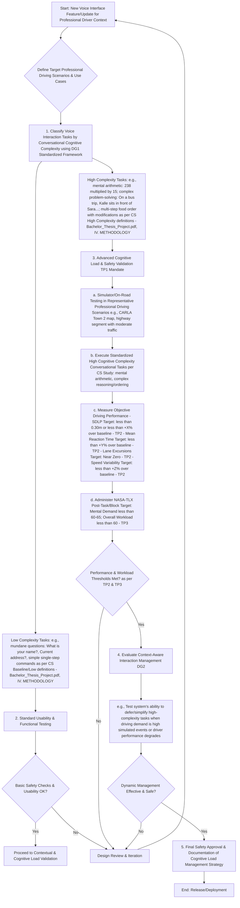

```mermaid
graph TD
    A[Start: New Voice Interface Feature/Update for Professional Driver Context] --> B{Define Target Professional Driving Scenarios & Use Cases};
    B --> C[1. Classify Voice Interaction Tasks by Conversational Cognitive Complexity using DG1 Standardized Framework];
    C --> C1[Low Complexity Tasks: e.g., mundane questions: What is your name?, Current address?, simple single-step commands as per CS Baseline/Low definitions - Bachelor_Thesis_Project.pdf, IV. METHODOLOGY];
    C --> C2[High Complexity Tasks: e.g., mental arithmetic: 238 multiplied by 15; complex problem-solving: On a bus trip, Kalle sits in front of Sara...; multi-step food order with modifications as per CS High Complexity definitions - Bachelor_Thesis_Project.pdf, IV. METHODOLOGY];

    C1 --> D[2. Standard Usability & Functional Testing];
    D --> E{Basic Safety Checks & Usability OK?};
    E -- Yes --> F[Proceed to Contextual & Cognitive Load Validation];
    E -- No --> R[Design Review & Iteration];

    C2 --> G[3. Advanced Cognitive Load & Safety Validation TP1 Mandate];
    G --> H[a. Simulator/On-Road Testing in Representative Professional Driving Scenarios e.g., CARLA Town 2 map, highway segment with moderate traffic];
    H --> I[b. Execute Standardized High Cognitive Complexity Conversational Tasks per CS Study: mental arithmetic, complex reasoning/ordering];
    I --> J[c. Measure Objective Driving Performance - SDLP Target: less than 0.30m or less than +X% over baseline - TP2 - Mean Reaction Time Target: less than +Y% over baseline - TP2 - Lane Excursions Target: Near Zero - TP2 - Speed Variability Target: less than +Z% over baseline - TP2];
    J --> K[d. Administer NASA-TLX Post-Task/Block Target: Mental Demand less than 60-65; Overall Workload less than 60 - TP3];

    K --> L{Performance & Workload Thresholds Met? as per TP2 & TP3};
    L -- No --> R;
    L -- Yes --> M[4. Evaluate Context-Aware Interaction Management DG2];
    M --> N[e.g., Test system's ability to defer/simplify high-complexity tasks when driving demand is high simulated events or driver performance degrades];
    N --> O{Dynamic Management Effective & Safe?};
    O -- No --> R;
    O -- Yes --> P[5. Final Safety Approval & Documentation of Cognitive Load Management Strategy];
    P --> Q[End: Release/Deployment];

    R --> A;
```
